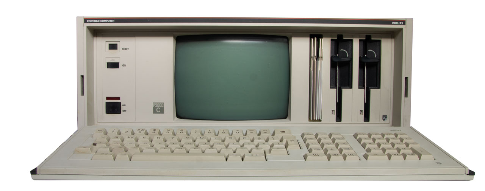
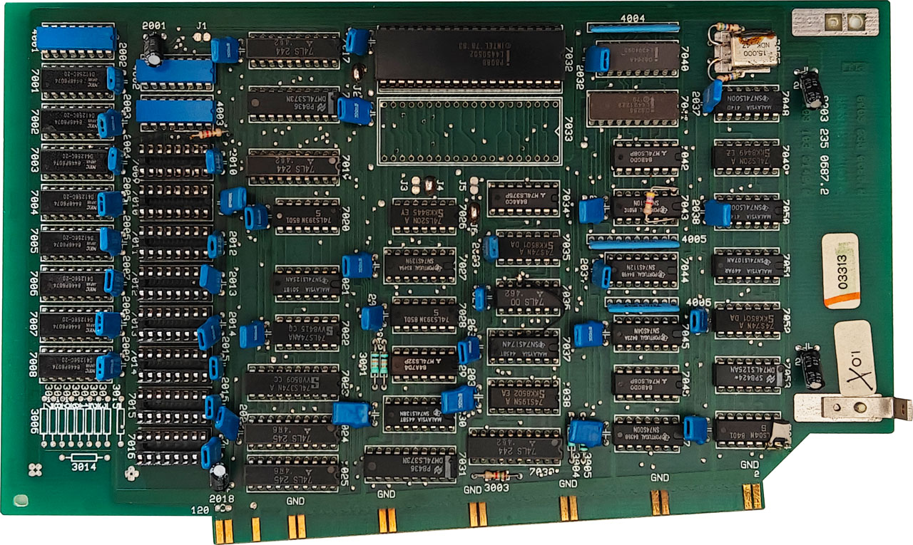

# Philips P2000C 8088 Assembly Programs

This repository contains a number of small 8088 assembly programs for the 16 bit
CoPower board (P2093) of the Philips P2000C.

**Philips P2000C**

**P2093 16 bit CoPower board**

